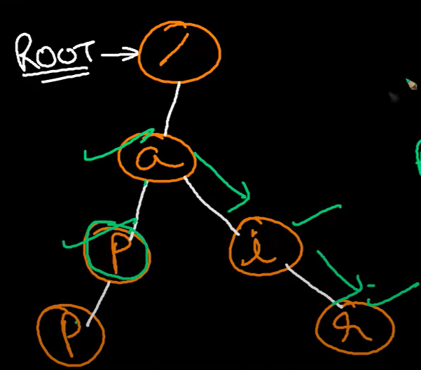

# Pre-requisites for this problem
- Understanding of Trie data structure.
- Implementation of Trie with insert and search functionalities.(Leetcode 208,1023)
- Serialization and deserialization of Trie nodes.(Leetcode 297)
- Serialization and deserialization of Binary Tree nodes.(Leetcode 297)

## Implementing Trie (Leetcode 208)
- Prefix Trie is a tree-like data structure that stores strings in a way that allows for efficient prefix searching.
- Each node in the Trie represents a character of a string, and the path from the root to a node represents a prefix of the string.
- Eg. 

```cpp
struct TrieNode {
    TrieNode* children[26];
    bool isEndOfWord;
    
    TrieNode() {
        isEndOfWord = false;
        for (int i = 0; i < 26; i++) {
            children[i] = nullptr;
        }
    }
};
class Trie {
public:
    TrieNode* root;

    Trie() {
        root = new TrieNode();
    }

    void insert(string word) {
        TrieNode* node = root;
        for (char c : word) {
            int index = c - 'a';
            if (!node->children[index]) {
                node->children[index] = new TrieNode();
            }
            node = node->children[index];
        }
        node->isEndOfWord = true;
    }

    bool search(string word) {
        TrieNode* node = root;
        for (char c : word) {
            int index = c - 'a';
            if (!node->children[index]) return false;
            node = node->children[index];
        }
        return node->isEndOfWord;
    }
};

// Example usage
Trie trie;
trie.insert("apple");
cout << trie.search("apple") << endl;   // returns true
cout << trie.search("app") << endl;      // returns false
```

## Serialization and Deserialization of Trie Nodes (Leetcode 297)
## Solution
[yt video](https://youtu.be/8G7grg45Pd4)