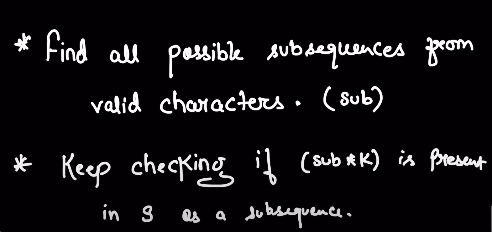
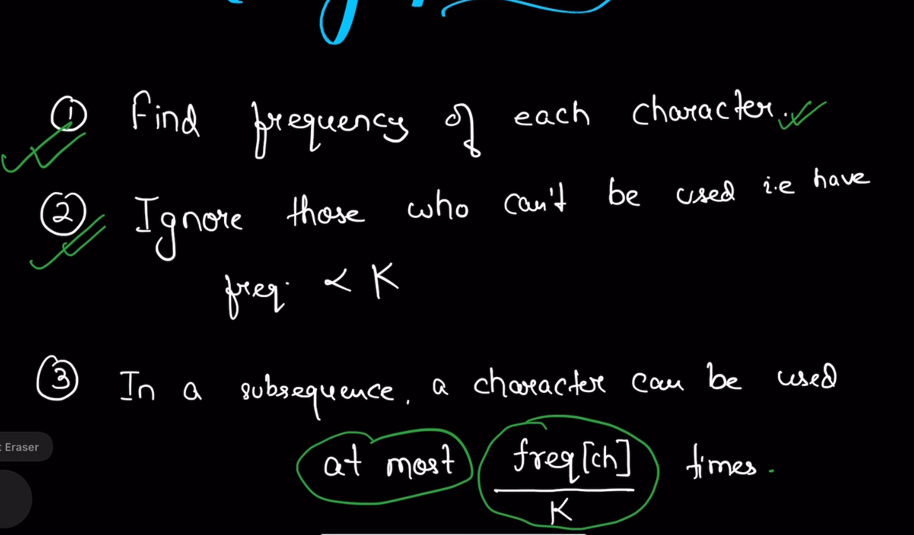
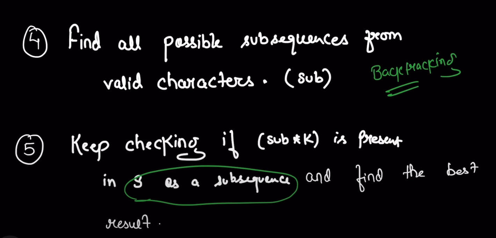
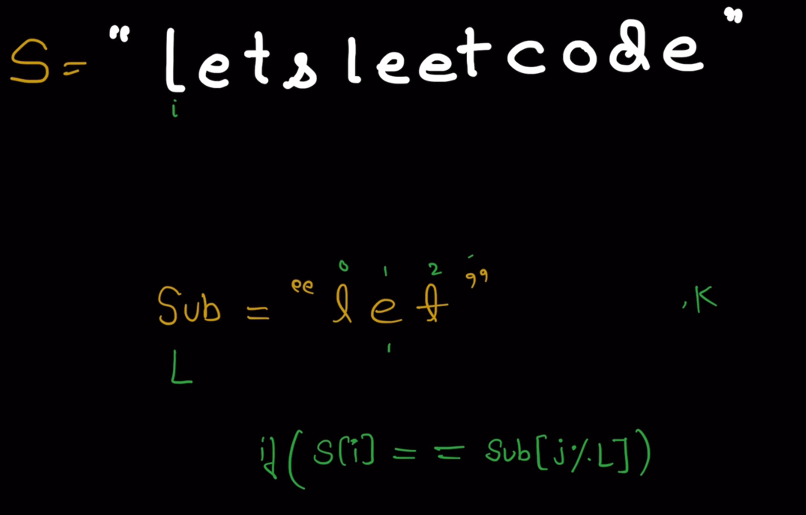

## Question: Longest Subsequence of frequency k

## Solution

### Simple and direct observation
- n=s.size()
- subsequence max length is l
- so, l * k <= n
- so, l <= n/k

### For Example
- s="letsleetcode" k=2
- i know the ans="let"
- i see frequency of each character>=k
- frequency of l=2, e=4, t=2, s=1, c=1, o=1, d=1
- so, i can remove s, c, o, d because they have frequency<k
- potential ans should include l, e, t






## Solution
```cpp
string result = "";

    bool isSubsequence(string &s, string& sub, int k) {
        int i = 0;
        int j = 0;
        int L = sub.length();
        int n = s.length();

        while(i < n && j < k*L) {
            if(s[i] == sub[j%L])
                j++;
            
            i++;
        }

        return j == k * L;
    }

    void backtracking(string& s, string &curr, vector<bool>& canUse, vector<int>& requiredFreq, int k, int maxLen) {
        if(curr.length() > maxLen)
            return;
        
        if((curr.length() > result.length() || (curr.length() == result.length() && curr > result))
            && isSubsequence(s, curr, k)) {
                result = curr;
        }

        for(int i = 0; i <= 25; i++) {
            if(canUse[i] == false || requiredFreq[i] == 0)
                continue;
            
            //DO
            char ch = i + 'a';
            curr.push_back(ch);
            requiredFreq[i]--;

            //EXPLORE
            backtracking(s, curr, canUse, requiredFreq, k, maxLen);

            //UNDO
            curr.pop_back();
            requiredFreq[i]++;

        }

    }

    string longestSubsequenceRepeatedK(string s, int k) {
        int n = s.length();

        int freq[26] = {};
        for(char &ch : s) {
            freq[ch-'a']++;
        }

        vector<bool> canUse(26, false);
        vector<int> requiredFreq(26, 0);
        for(int i = 0; i < 26; ++i) {
            if(freq[i] >= k) {
                canUse[i] = true;
                requiredFreq[i] = freq[i]/k; //atmost this can be used in a subsequence
            }
        }

        int maxLen = n / k;

        string curr;
        backtracking(s, curr, canUse, requiredFreq, k, maxLen);

        return result;


    }
    ```