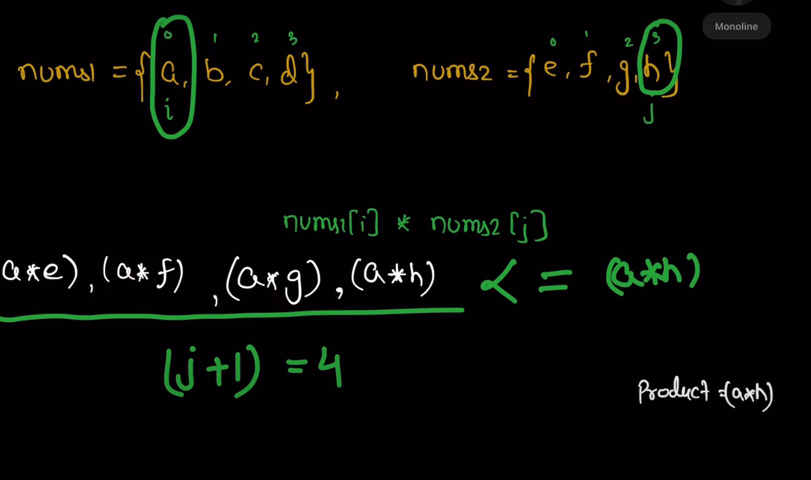

## Intuition
- my first intuition was prefix sum or something like that, but it was not working
arr1={2,5}
arr2={3,4}

comparision= min(arr1[0]*arr2[1], arr1[1]*arr2[0])

if(smallest in arr1 >0 and smallest in arr2 >0):
    ans= arr1[0]*arr2[0]
else if(smallest in arr1 >0 and smallest in arr2 <0):
    ans= arr1[0]*arr2[1]
else if(smallest in arr1 <0 and smallest in arr2 >0):
    ans= arr1[1]*arr2[0]
else if(smallest in arr1 <0 and smallest in arr2 <0):
    ans= arr1[1]*arr2[1]

# Solution:

## Whenever Kth smallest or largest is asked, use Heap
- So, take a max_heap of size k
### Example:
{2,5} {3,4} k=2
- max heap of size 2
- push 2*3,         Heap={6}
- push 2*4,         Heap={8,6}
- push 5*3,         Heap={15,8,6}, pop 15, Heap={8,6}
- push 5*4,         Heap={20,8,6}, pop 20, Heap={8,6}
- return 8
But Still it'll give TLE, so we need to optimize it further

## Optimized Solution:
- I have both the arrays sorted
- And with the large constraints, I know I will not multiply all the elements
- 
- Handwritten Notes: [iPad Notes](https://github.com/MAZHARMIK/Interview_DS_Algo/blob/master/iPad%20PDF%20Notes/Leetcode-2040.pdf)
