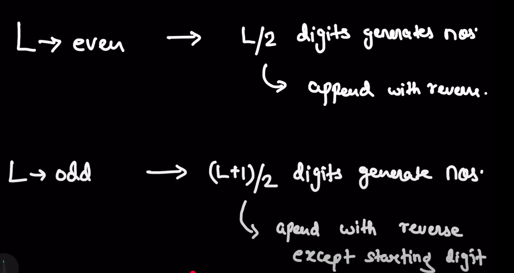

## From Hint 1, for base 10, check only for palindrome numbers.

### Generating base 10 palindrome numbers:
```cpp
#include <bits/stdc++.h>
using namespace std;
string generatePalindrome(int n) {
    string s = to_string(n);
    string rev = s;
    reverse(rev.begin(), rev.end());
    return s + rev;
}

cout<<stoi(generatePalindrome(123)); // Example usage
```

# I finally saw the solution
- make decimal palindromes
    - to generate palindromes:
## Generating palindromes of length n:
- Finding Length-wise palindrome is easy.
### Rough
    1 2 3 4 5 6 7 8 9
    11 22 33 44 55 66 77 88 99
    101 111 121 131 141 151 161 171 181 ...
### Example Even Length
- 4-digit palindromes:
    12 21  reversed
### Example Odd Length
- 5-digit palindromes:
    12 3 21     center digit is left out and else is reversed
- method: for 123
    1. reverse the string   321
    2. leave the first character    21
    3. append the reversed string to the original string    12321

- in cpp, (l+1)/2 works for both even and odd lengths.


# This question actually taught me a concept. A lot about palindromes.
- It was not merely a repeat question.