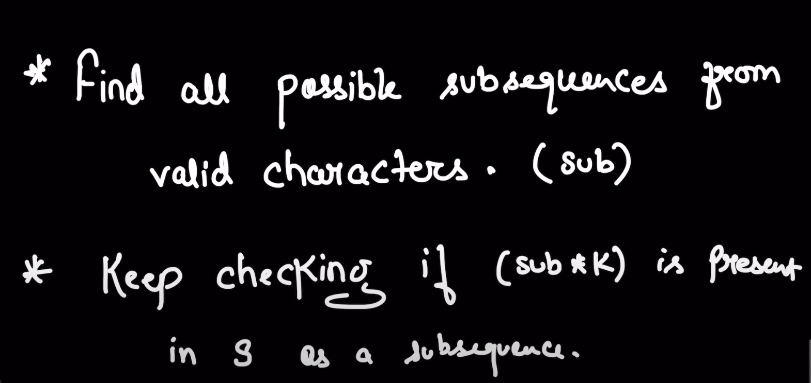
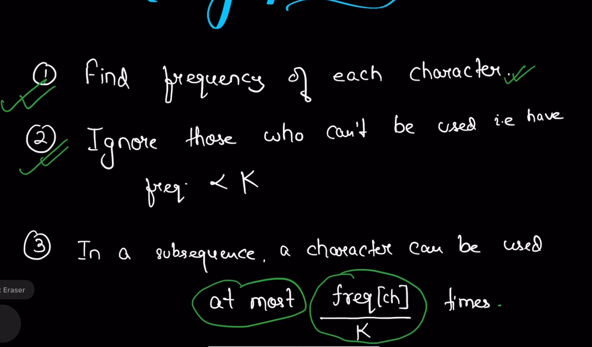
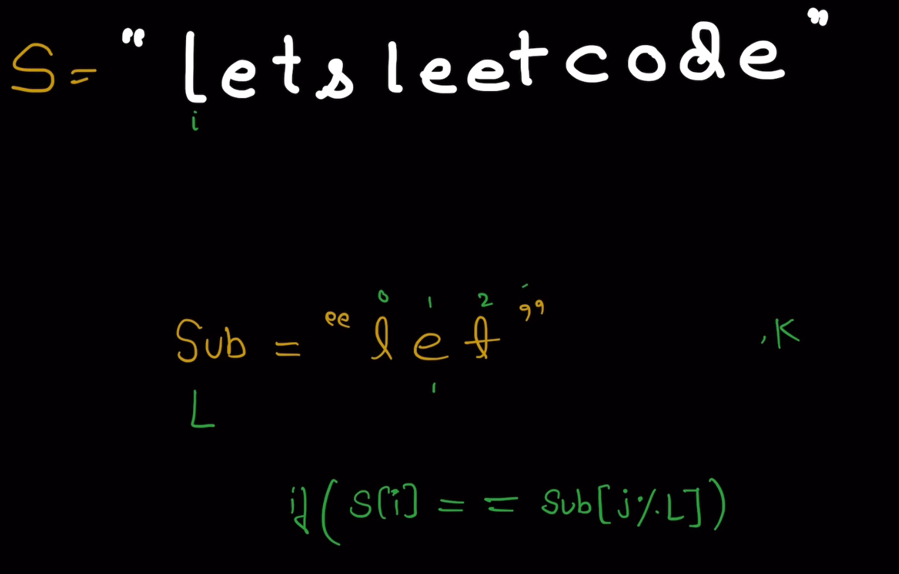

## Question: Longest Subsequence of frequency k

## Solution

### Simple and direct observation
- n=s.size()
- subsequence max length is l
- so, l * k <= n
- so, l <= n/k

### For Example
- s="letsleetcode" k=2
- i know the ans="let"
- i see frequency of each character>=k
- frequency of l=2, e=4, t=2, s=1, c=1, o=1, d=1
- so, i can remove s, c, o, d because they have frequency<k
- potential ans should include l, e, t

### 
