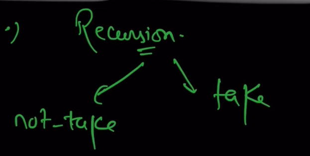

## Question: [2311](https://leetcode.com/problems/longest-binary-subsequence-less-than-or-equal-to-k/description/?envType=daily-question&envId=2025-06-26)

### Brute Force
- make a function to check if a binary string is less than or equal to k
- iterate through all binary strings of length n
- check if the binary string is less than or equal to k

### Another Approach
- make a vector to store which bits are set in which position


## my understanding from solution
- make a double loop to iterate through the bits, from last to first
  ```cpp
  int maxi=0;
  for(int i = n - 1; i >= 0; i--) {
      if((k & (1 << i)) != 0) {
          maxi = max(maxi, i);
      }

  }
  ```


# Solution (from YT)
## Method 1: Recursion

- but this is exponential time complexity, so we need to optimize it
 
## Method 2: Optimization
- loop from the last bit to the first bit
- if the current bit is set in k, we can either include it or not, by calculating
- if the current bit is not set in k, we can include it blindly


## Method by AI : Dynamic Programming
- use a 2D dp array where dp[i][j] represents the number of binary
subsequences of length i that are less than or equal to j
- iterate through the bits of k and update the dp array accordingly
- the final answer will be the sum of all dp[i][j] where i is the length of the binary string and j is less than or equal to k